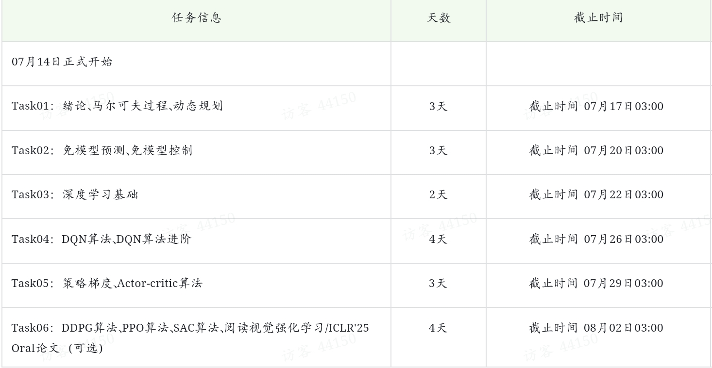

# Datawhale_RL_Learning

## 学习打卡指南

【教程地址】
https://github.com/datawhalechina/joyrl-book
 
1、学习模式：通过组队的形式共同学习，互相交流，互相督促，共同进步，组队的人数建议为【5-8人】。 
如果是非常自律且不喜欢被别人打扰的大佬，可以不组队。 
【组队登记】 https://bcngb3k2q7v5.feishu.cn/wiki/GcwIw5zdBiSd9GkMtslcqrUgnTf?from=from_copylink
 
2、打卡规则：本次学习需要按照相应时间节点完成学习任务，在打卡截止时间前完成打卡。 
【打卡地址】
https://exn8g66dnwu.feishu.cn/share/base/form/shrcn9C1lXRX3zBmpTwUzEc7Atd

3、打卡内容：包括但不限于学习到的知识总结、学习遇到的问题和对本次task的感受。希望大家尽量自己总结撰写，不要复制教程，不要写与本次学习无关的内容。 
easy模式：在打卡栏填写50字打卡心得。 
normal模式：在公开平台输出自己的笔记心得【CSDN、github、简书等】，在打卡链接栏填写笔记链接。注意链接的访问权限需要是公开可见的。
【注意】链接笔记请标注课程资料及其它引用资料来源链接，保护资料作者权益。没有标注可能会影响笔记评分哦！！！ 
链接笔记会被助教评审打分，作为评优的重要参考因素。没有链接打卡的，基本上就无缘优秀学习者了~

基本上，大部分助教都更喜欢有自己想法又精炼的笔记。不需要特别大而全，但是最好是自己思考的成果~
更不需要使用大模型来凑字数。看多了，一眼就知道是大模型生成的~

4、打卡进度



## 环境搭建
创建`Python`环境(需先安装[Anaconda3](https://www.anaconda.com/download)或[Miniforge3](https://github.com/conda-forge/miniforge/releases/tag/24.11.3-0))：

```bash
conda create -n joyrl-book python=3.10
conda activate joyrl-book
```

安装Torch：

```bash
# CPU
pip install torch==2.2.1 torchvision==0.17.1 torchaudio==2.2.1
# CUDA 12.1
pip install torch==2.2.1 torchvision==0.17.1 torchaudio==2.2.1 --index-url https://download.pytorch.org/whl/cu121
```

安装其他依赖：

```bash
pip install -r requirements.txt
```

## 运行

选择感兴趣的`*.ipynb`文件，然后使用`Jupyter Notebook`打开并运行即可，推荐使用`VS Code`的`Jupyter`插件