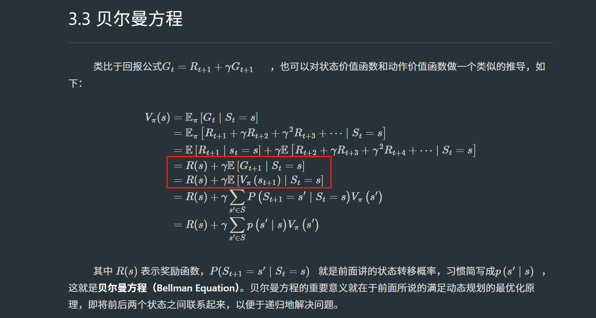
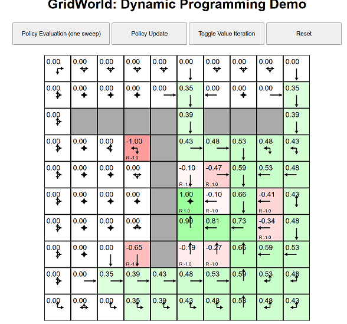

# Task01：绪论、马尔可夫过程、动态规划

## [绪论](https://datawhalechina.github.io/joyrl-book/#/ch1/main)

## [马尔可夫过程](https://datawhalechina.github.io/joyrl-book/#/ch2/main)
- 回报公式：Gt = R(t+1) + γG(t+1) = R(t+1) + γR(t+2) + γ^2G(t+2) + ...

## [动态规划](https://datawhalechina.github.io/joyrl-book/#/ch3/main)
- 动态规划基础编程思想：[路径之和](https://leetcode.cn/problems/unique-paths/solutions/514311/bu-tong-lu-jing-by-leetcode-solution-hzjf/)
- 状态价值函数：Vpi(s) = Epi[Gt|St=s]
- 动作价值函数：Qpi(s,a) = Epi[Gt|St=s,At=a]
- 对应的，状态价值函数和动作价值函数的关系为：Vpi(s) = Qpi(s,a1)*P(a1|s) + Qpi(s,a2)*P(a2|s) + ...
  - P(a*|s)：可以理解为策略函数，一般指在状态s下执行动作a*的概率分布。a*归属于动作空间A。
- 贝尔曼方程：
  - 对于状态价值函数（状态价值函数贝尔曼方程）：
  
  
  - 对于动作价值函数（动作价值函数贝尔曼方程）：
  
  
  - 贝尔曼最优方程（Bellman optimality equation）：
  
- 策略迭代（Policy Iteration）和价值迭代（Value Iteration）：
  - [带两种逐步推导的例子：公主的营救](https://mp.weixin.qq.com/s/ub4EpRZAtny2KTeJqNimbQ)
  - [GridWorld: Dynamic Programming Demo](https://cs.stanford.edu/people/karpathy/reinforcejs/gridworld_dp.html)
    - 策略迭代算法：一次迭代包括两个步骤，首先是策略评估对应Policy Evaluation(one sweep)，然后是策略改进对应Policy Update
    
    
    
    ```javascript
    // State space: GridWorld has 10x10 = 100 distinct states. The start state is the top left cell. The gray cells are walls and cannot be moved to.
    // this.V (value function array)
    // this.gamma (discount factor), here is 0.9
    // this.ns (number of states)
    // this.P which stores the current policy
    // this.env, which is a pointer to the Environment object
    // The policy array is one-dimensional in this implementation, but stores the probability of taking any action in any state, so I'm using funny indexing (this.P[a*this.ns + s]) to not have to deal with 2D arrays in Javascript

    evaluatePolicy: function() {
      // perform a synchronous update of the value function
      var Vnew = zeros(this.ns); // initialize new value function array for each state
      for(var s=0; s < this.ns; s++) {
        var v = 0.0;
        var poss = this.env.allowedActions(s); // fetch all possible actions
        for(var i=0,n=poss.length; i < n; i++) {
          var a = poss[i];
          var prob = this.P[a*this.ns+s]; // probability of taking action under current policy
          var ns = this.env.nextStateDistribution(s, a); // look up the next state
          var rs = this.env.reward(s, a, ns); // get reward for s->a->ns transition
          v += prob * (rs + this.gamma * this.V[ns]);
        }
        Vnew[s] = v;
      }
      this.V = Vnew; // swap
    },

    updatePolicy: function() {
      // update policy to be greedy w.r.t. learned Value function
      // iterate over all states...
      for(var s=0; s < this.ns; s++) {
        var poss = this.env.allowedActions(s);
        // compute value of taking each allowed action
        var vmax, nmax;
        var vs = [];
        for(var i=0,n=poss.length; i < n; i++) {
          var a = poss[i];
          // compute the value of taking action a
          var ns = this.env.nextStateDistribution(s, a);
          var rs = this.env.reward(s, a, ns);
          var v = rs + this.gamma * this.V[ns];
          // bookeeping: store it and maintain max
          vs.push(v);
          if(i === 0 || v > vmax) { vmax = v; nmax = 1; }
          else if(v === vmax) { nmax += 1; }
        }
        // update policy smoothly across all argmaxy actions
        for(var i=0,n=poss.length; i < n; i++) {
          var a = poss[i];
          this.P[a*this.ns + s] = (vs[i] === vmax) ? 1.0/nmax : 0.0;
        }
      }
    },

    // create environment
    env = new Gridworld(); 
    // create the agent, yay! Discount factor 0.9
    agent = new RL.DPAgent(env, {'gamma':0.9}); 
    // call this function repeatedly until convergence:
    agent.learn();
    // once trained, get the agent's behavior with:
    var action = agent.act(); // returns the index of the chosen action
    ```
    - 价值迭代算法：对应点击Toggle Value Iteration（全流程自动执行）


