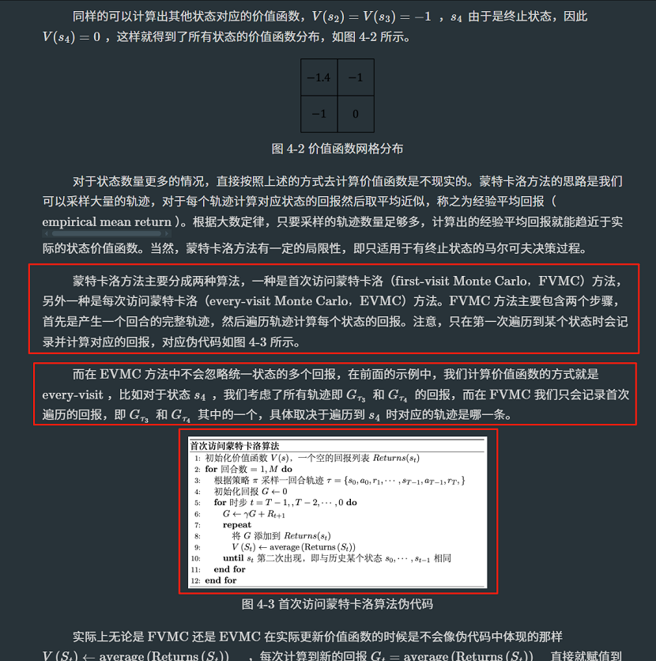
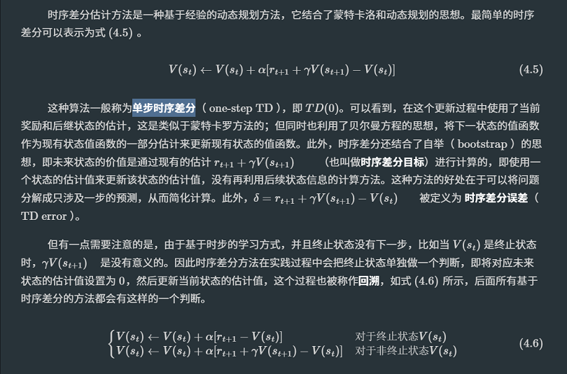
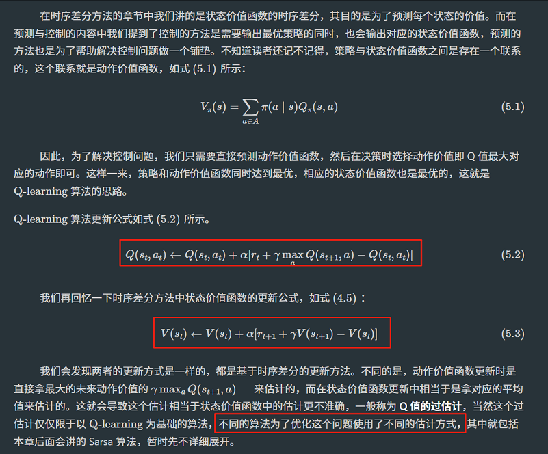

# Task02：免模型预测、免模型控制
状态转移概率是已知的，这种情况下使用的算法称之为有模型算法，例如动态规划算法。但大部分情况下对于智能体来说，环境是未知的，这种情况下的算法就称之为免模型算法，目前很多经典的强化学习算法都是免模型的。当然近年来出现了一些新的强化学习算法，例如[PlaNet](https://zhuanlan.zhihu.com/p/57468070)、[Dreamer](https://zhuanlan.zhihu.com/p/137261461)和[World Models](https://zhuanlan.zhihu.com/p/21498615281)等。这些算法利用了神经网络和其他机器学习方法建立一个近似的环境模型，并使用规划和强化学习的方法进行决策，这些算法也都称为有模型算法。

有模型强化学习尝试先学习一个环境模型，它可以是环境的动态（例如，给定一个状态和一个动作，预测下一个状态）或奖励（给定一个状态和一个动作，预测奖励），即前面小节所讲的状态转移概率和奖励函数。一旦有了这个环境模型，智能体可以使用它来计划最佳的行动策略，例如通过模拟可能的未来状态来预测哪个动作会导致最大的累积奖励。它的优点很明显，即可以在不与真实环境交互的情况下进行学习，因此可以节省实验的成本。但缺点是，这种模型往往是不完美的，或者是复杂到难以学习和计算。

而免模型则直接学习在特定状态下执行特定动作的价值或优化策略。它直接从与环境的交互中学习，不需要建立任何预测环境动态的模型。其优点是不需要学习可能是较为复杂的环境模型，更加简单直接，但是缺点是在学习过程中需要与真实环境进行大量的交互。注意，除了动态规划之外，基础的强化学习算法都是免模型的。

## 预测与控制
- 预测：前面提到很多经典的强化学习算法都是免模型的，换句话说在这种情况下环境的状态转移概率是未知的，这种情况下会去近似环境的状态价值函数，这其实跟状态转移概率是等价的，我们把这个过程称为预测。换句话说，预测的主要目的是估计或计算环境中的某种期望值，比如状态价值函数V(s)或动作价值函数Q(s, a)。例如，我们正在玩一个游戏，并想知道如果按照某种策略玩游戏，我们的预期得分会是多少。
- 控制：控制的目标则是找到一个最优策略，该策略可以最大化期望的回报。换句话说，你不仅想知道按照某种策略你的预期得分是多少，还想知道如何选择动作以最大化这个得分。控制问题通常涉及两个相互交替的步骤：策略评估（使用当前策略估计值函数）和策略改进（基于当前的值函数更新策略）。
- 在实际应用中，预测和控制问题经常交织在一起。例如，在使用Q-learning（一种免模型的控制算法）时，我们同时进行预测（更新Q值）和控制（基于Q值选择动作）。之所以提到这两个概念，是因为很多时候我们不能一蹴而就解决好控制问题，而需要先解决预测问题，进而解决控制问题。

## 免模型预测
- 蒙特卡洛估计：蒙特卡洛估计方法在强化学习中是免模型预测价值函数的方式之一，本质是一种统计模拟方法。

- 时序差分估计方法：TD（Temporal Difference）学习是强化学习中另一种免模型预测价值函数的方法，它结合了蒙特卡洛方法和动态规划的优点。

- 蒙特卡洛估计和时序差分估计的区别和联系

## 免模型控制
回顾前面讲的控制，即给定一个马尔可夫决策过程，输出最优策略以及对应的最优价值函数。而免模型则是指不需要知道环境的状态转移概率的一类算法，实际上很多经典的强化学习算法都是免模型控制的。本章会重点介绍两种基础的免模型算法，Q-learning和Sarsa，也都是基于时序差分的方法。
- Q-learning：Q-learning是一种免模型的控制算法，它通过迭代更新Q值来找到最优策略。

- Sarsa 算法：Sarsa算法也是一种免模型的控制算法，它与Q-learning类似，但它在更新策略时使用了下一个动作的值（所以是一种On-policy算法）。

- Q-learning代码实战：[QLearning_CliffWalking-v0：使用QLearning这个agent来训练和测试CliffWalking-v0这个env](./QLearning_CliffWalking-v0.ipynb)和[CliffWalking-v0源代码-自己加了一些注释](./cliffwalking.py)。尤其注意观察Jupyter脚本最后输出Log中Q_table的变化，可以通过理解Q_table中各个状态空间价值更新的过程，来深入理解Q-learning算法的原理。

