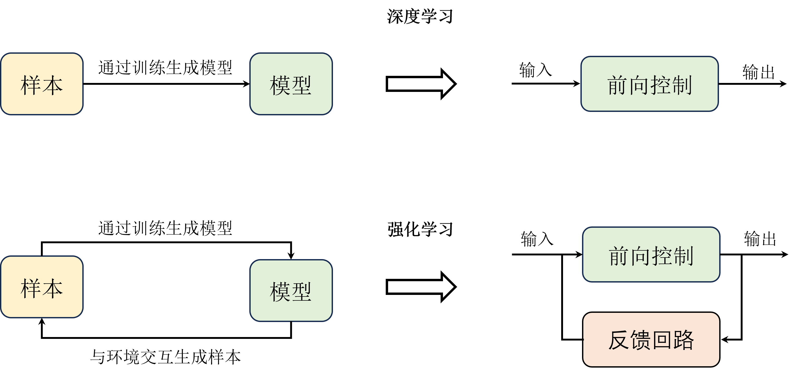
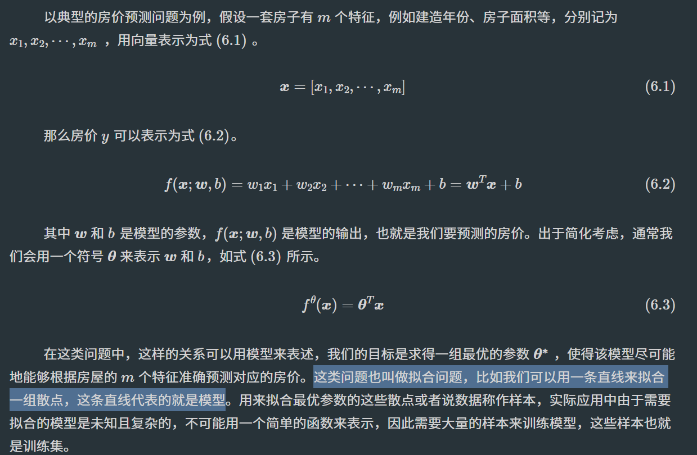
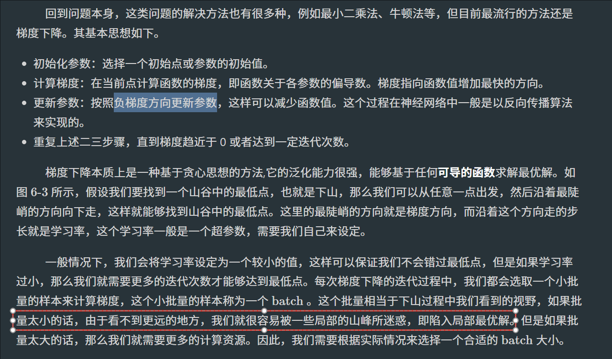
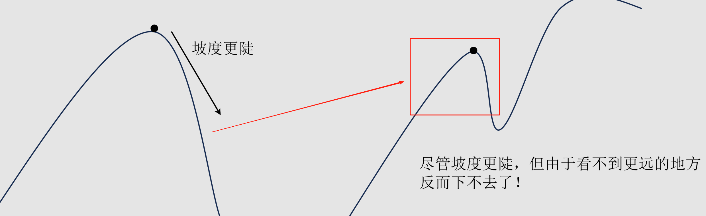
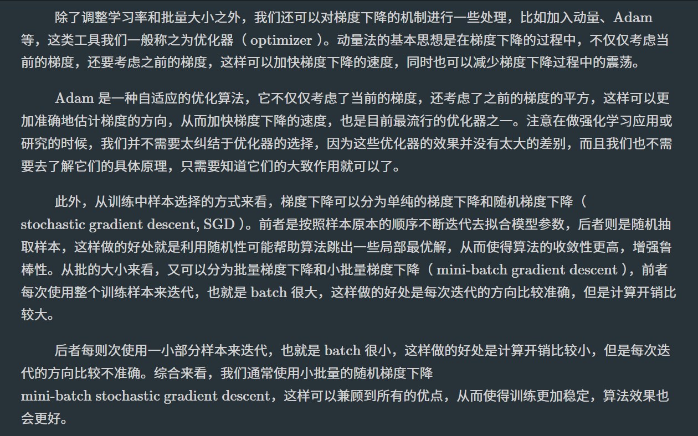

# Task03：深度学习基础
之前我们讲到了强化学习的问题可以拆分成两类问题，即预测和控制。预测的主要目的是根据环境的状态和动作来预测状态价值和动作价值，而控制的主要目的是根据状态价值和动作价值来选择动作。换句话说，预测主要是告诉我们当前状态下采取什么动作比较好，而控制则是按照某种方式决策。就好比军师与主公的关系，军师提供他认为最佳的策略，而主公则决定是否采纳这个策略（比如加入ε-greedy探索策略，对利用和探索两种策略进行适当平衡，而不是按照预测的最佳策略来实施控制）。

通常在强化学习中预测和控制的部分看起来是共用一个Q表或者神经网络的，因此读者们可能会因为主要关注价值函数的估计而忽视掉控制这层关系，控制通常在采样动作的过程中体现出来。其实在前面也提到过，预测也相当于人的眼睛和大脑的视觉神经处理部分，而控制相当于大脑的决策神经处理部分，看似是两个独立的部分，但实际上是相互依赖的，预测的结果会影响到控制的决策，而控制的决策也会影响到预测的结果。深度学习就是用来提高强化学习中预测的效果的，因为深度学习本身就是一个目前预测和分类效果俱佳的工具。比如Q-learning的Q表就完全可以用神经网络来拟合。

## 强化学习与深度学习
从训练模式上来看，深度学习和强化学习，尤其是结合了深度学习的深度强化学习，都是基于大量的样本来对相应算法进行迭代更新并且达到最优的，这个过程我们称之为训练。但与另外两者不同的是，强化学习是在交互中产生样本的，是一个产生样本、算法更新、再次产生样本、再次算法更新的动态循环训练过程，而不是一个准备样本、算法更新的静态训练过程。

这本质上还是跟要解决的问题不同有关，强化学习解决的是序列决策问题，而深度学习解决的是“打标签”问题，即给定一张图片，我们需要判断这张图片是猫还是狗，这里的猫和狗就是标签，当然也可以让算法自动打标签，这就是监督学习与无监督学习的区别。而强化学习解决的是“打分数”问题，即给定一个状态，我们需要判断这个状态是好还是坏，这里的好和坏就是分数。当然，这只是一个比喻，实际上强化学习也可以解决“打标签”问题，只不过这个标签是一个连续的值，而不是离散的值，比如我们可以给定一张图片，然后判断这张图片的美观程度，这里的美观程度就是一个连续的值，而不是离散的值。

如下图所示，除了训练生成模型之外，强化学习相当于在深度学习的基础上增加了一条回路，即继续与环境交互产生样本。这个回路就是一个典型的反馈系统机制，模型的输出一开始并不能达到预期的值，因此通过动态地不断与环境交互来产生一些反馈信息，从而训练出一个更好的模型。

## 线性回归，梯度下降与逻辑回归
本节开始总结归纳强化学习用到的一些深度学习模型，首先是线性模型。严格来说，线性模型并不是深度学习模型，而是传统的机器学习模型，但它是深度学习模型的基础，在深度学习中相当于单层的神经网络。在线性模型中，应用较为广泛的两个基础模型就是线性回归和逻辑回归，通常分别用于解决回归和分类问题，尽管后者也可以用来解决回归问题。
- 线性回归

- 梯度下降

- 逻辑回归

## 全连接网络

## 更高级的神经网络（CNN，RNN）
- CNN（卷积神经网络）：
- RNN（循环神经网络）：

