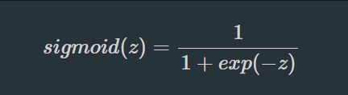
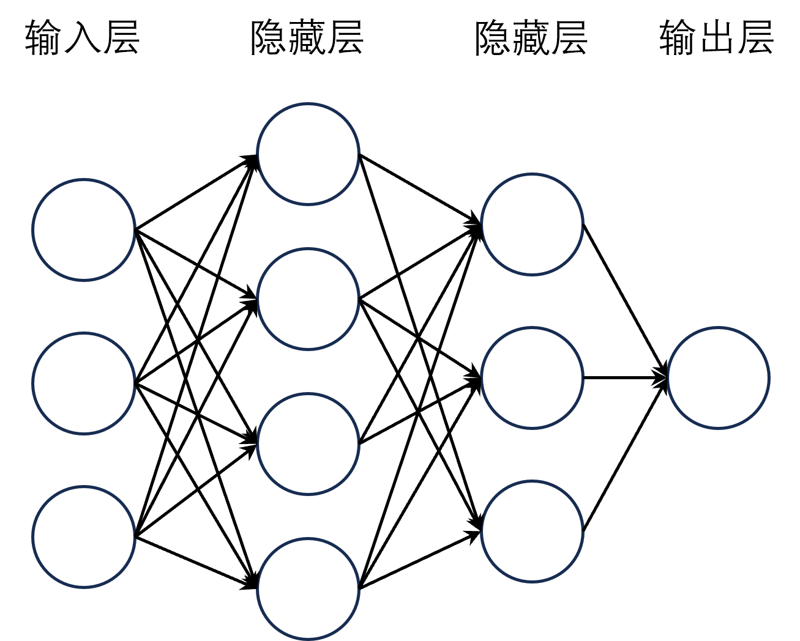
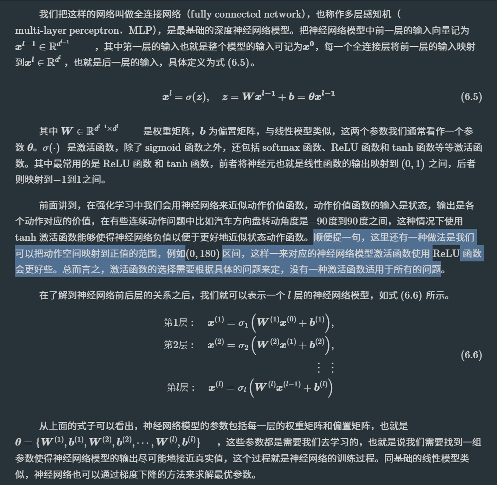
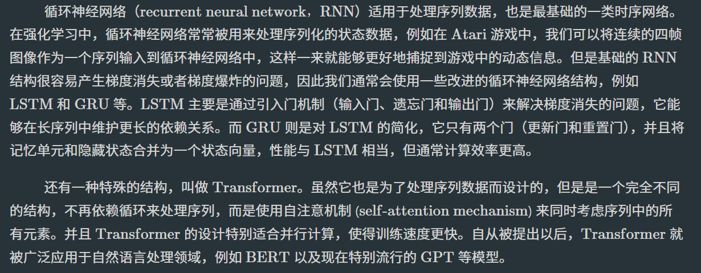

# Task03：深度学习基础
之前我们讲到了强化学习的问题可以拆分成两类问题，即预测和控制。预测的主要目的是根据环境的状态和动作来预测状态价值和动作价值，而控制的主要目的是根据状态价值和动作价值来选择动作。换句话说，预测主要是告诉我们当前状态下采取什么动作比较好，而控制则是按照某种方式决策。就好比军师与主公的关系，军师提供他认为最佳的策略，而主公则决定是否采纳这个策略（比如加入ε-greedy探索策略，对利用和探索两种策略进行适当平衡，而不是按照预测的最佳策略来实施控制）。

通常在强化学习中预测和控制的部分看起来是共用一个Q表或者神经网络的，因此读者们可能会因为主要关注价值函数的估计而忽视掉控制这层关系，控制通常在采样动作的过程中体现出来。其实在前面也提到过，预测也相当于人的眼睛和大脑的视觉神经处理部分，而控制相当于大脑的决策神经处理部分，看似是两个独立的部分，但实际上是相互依赖的，预测的结果会影响到控制的决策，而控制的决策也会影响到预测的结果。深度学习就是用来提高强化学习中预测的效果的，因为深度学习本身就是一个目前预测和分类效果俱佳的工具。比如Q-learning的Q表就完全可以用神经网络来拟合。

## 强化学习与深度学习
从训练模式上来看，深度学习和强化学习，尤其是结合了深度学习的深度强化学习，都是基于大量的样本来对相应算法进行迭代更新并且达到最优的，这个过程我们称之为训练。但与另外两者不同的是，强化学习是在交互中产生样本的，是一个产生样本、算法更新、再次产生样本、再次算法更新的动态循环训练过程，而不是一个准备样本、算法更新的静态训练过程。

这本质上还是跟要解决的问题不同有关，强化学习解决的是序列决策问题，而深度学习解决的是“打标签”问题，即给定一张图片，我们需要判断这张图片是猫还是狗，这里的猫和狗就是标签，当然也可以让算法自动打标签，这就是监督学习与无监督学习的区别。而强化学习解决的是“打分数”问题，即给定一个状态，我们需要判断这个状态是好还是坏，这里的好和坏就是分数。当然，这只是一个比喻，实际上强化学习也可以解决“打标签”问题，只不过这个标签是一个连续的值，而不是离散的值，比如我们可以给定一张图片，然后判断这张图片的美观程度，这里的美观程度就是一个连续的值，而不是离散的值。

如下图所示，除了训练生成模型之外，强化学习相当于在深度学习的基础上增加了一条回路，即继续与环境交互产生样本。这个回路就是一个典型的反馈系统机制，模型的输出一开始并不能达到预期的值，因此通过动态地不断与环境交互来产生一些反馈信息，从而训练出一个更好的模型。

## 线性回归，梯度下降与逻辑回归
本节开始总结归纳强化学习用到的一些深度学习模型，首先是线性模型。严格来说，线性模型并不是深度学习模型，而是传统的机器学习模型，但它是深度学习模型的基础，在深度学习中相当于单层的神经网络。在线性模型中，应用较为广泛的两个基础模型就是线性回归和逻辑回归，通常分别用于解决回归和分类问题，尽管后者也可以用来解决回归问题。
- 线性回归

- 梯度下降

- 逻辑回归
逻辑回归名字中带有回归，但是它是用来解决分类问题的，而不是回归问题（即预测问题）。在分类问题中，我们的目标是预测样本的类别，而不是预测一个连续的值。例如，我们要预测一封邮件是否是垃圾邮件，这就是一个二分类问题，通常输出0和1等离散的数字来表示对应的类别。在形式上，逻辑回归和线性回归非常相似，就是在线性模型的后面增加一个sigmoid函数，我们一般称之为激活函数。sigmoid函数定义和函数图像：

sigmoid函数可以将输入的任意实数映射到(0,1)的区间内，对其输出的值进行判断，例如小于0.5我们认为预测的是类别0，反之是类别1，这样一来通过梯度下降来求解模型参数就可以用于实现二分类问题了。注意，虽然逻辑回归只是在线性回归模型基础上增加了一个激活函数，但两个模型是完全不同的，包括损失函数等等。线性回归的损失函数是均方差损失，而逻辑回归模型一般是交叉熵损失，这两种损失函数在深度学习和深度强化学习中都很常见。

逻辑回归的主要优点在于增加了模型的非线性能力，同时模型的参数也比较容易求解，但是它也有一些缺点，例如它的非线性能力还是比较弱的，而且它只能解决二分类问题，不能解决多分类问题。在实际应用中，我们一般会将多个二分类问题组合成一个多分类问题，例如将sigmoid函数换成softmax回归函数等。

同时，逻辑回归这类模型的结构也比较灵活多变，可以通过横向堆叠的形式来增加模型的复杂度，例如增加隐藏层等，这样就能解决更复杂的问题，这就是接下来要讲的神经网络模型。并且，我们可以认为逻辑回归就是一个最简单的人工神经网络模型。

## 全连接网络
如下图所示，将线性层横向堆叠起来，前一层网络的所有神经元的输出都会输入到下一层的所有神经元中，这样就可以得到一个全连接网络。其中，每个线性层的输出都会经过一个激活函数（图中已略去），这样就可以增加模型的非线性能力。

## 更高级的神经网络（CNN，RNN）
- CNN（卷积神经网络）：卷积神经网络（convolutional neural network，CNN）适用于处理具有网格结构的数据，如图像（2D 网格像素点）或时间序列数据（1D网格）等，其中图像是用得最为广泛的。比如在很多的游戏场景中，其状态输入都是以图像的形式呈现的，并且图像能够包含更多的信息，这个时候我们就可以使用卷积神经网络来处理这些图像数据。在使用卷积神经网络的时候，我们需要注意以下几个主要特点：
  - 卷积层：卷积层是CNN的核心，它通过滑动窗口的方式提取图像的局部特征。在深度学习中，我们通常使用二维卷积核（例如3x3或5x5）来对输入图像进行卷积操作，从而得到一系列的特征图
  - 权重共享：在卷积层中，同一卷积核会应用于输入图像的多个位置，从而实现权重的共享。
  - 池化层：池化层通常位于卷积层之后，用于降低特征图的维度并减少计算量。常见的池化操作包括最大池化和平均池化
  - 激活函数：在卷积层和全连接层之后，通常会使用非线性激活函数（如ReLU）来增加模型的表达能力。
  - 归一化层：为了提高模型的收敛速度和稳定性，我们通常会在卷积神经网络中加入批归一化（Batch Normalization）或层归一化（Layer Normalization）等归一化技术。
  - dropout：为了避免过拟合，我们通常会在卷积神经网络中加入dropout技术。

- RNN（循环神经网络）：

