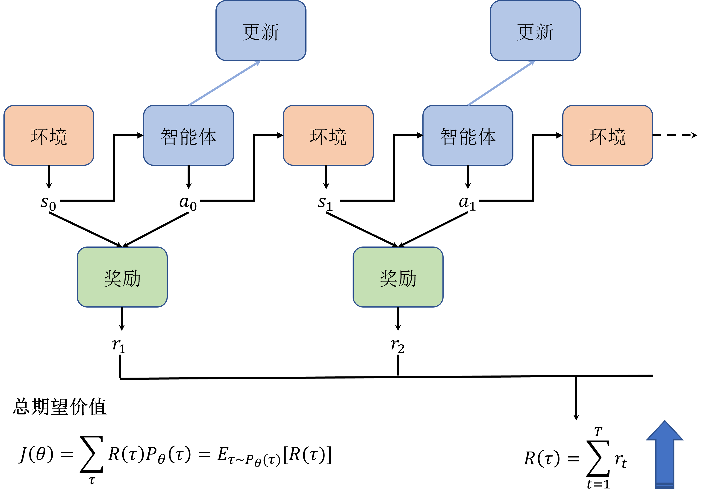
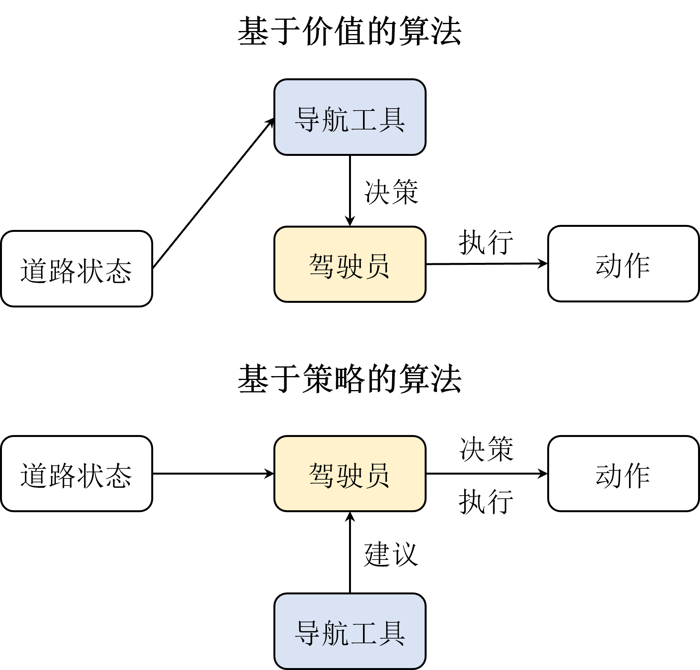

# Task05：策略梯度、Actor-critic算法

## 策略梯度算法
策略梯度（policy-based）的算法，与前面介绍的基于价值（value-based）的算法（包括DQN等算法）不同，这类算法直接对策略本身进行近似优化。

以DQN算法为代表的基于价值的算法在很多任务上都取得了不错的效果，并且具备较好的收敛性，但是这类算法也存在一些缺点。
- 无法表示连续动作（比如前面的CartPole-v1是输出的左、右动作）。由于DQN等算法是通过学习状态和动作的价值函数来间接指导策略的，因此它们只能处理离散动作空间的问题，无法表示连续动作空间的问题。而在一些问题中，比如机器人的运动控制问题，连续动作空间是非常常见的，比如要控制机器人的运动速度、角度等等，这些都是连续的量。
- 高方差。基于价值的方法通常都是通过采样的方式来估计价值函数，这样会导致估计的方差很高，从而影响算法的收敛性。尽管一些DQN改进算法，通过改善经验回放、目标网络等方式，可以在一定程度上减小方差，但是这些方法并不能完全解决这个问题。
- 探索与利用的平衡问题。DQN等算法在实现时通常选择贪心的确定性策略，而很多问题的最优策略是随机策略，即需要以不同的概率选择不同的动作。虽然可以通过DQN策略等方式来实现一定程度的随机策略，但是实际上这种方式并不是很理想，因为它并不能很好地平衡探索与利用的关系。

    
 CartPole-v1选择动作部分的代码 

    <pre><code>
    class Policy:
        ...   
        def sample_action(self, state):
            ''' 采样动作
            '''
            self.sample_count += 1
            # epsilon指数衰减
            self.epsilon = self.epsilon_end + (self.epsilon_start - self.epsilon_end) * \
                math.exp(-1. * self.sample_count / self.epsilon_decay) 
            if random.random() > self.epsilon:
                with torch.no_grad():
                    state = torch.tensor(state, device=self.device, dtype=torch.float32).unsqueeze(dim=0)
                    q_values = self.policy_net(state)
                    action = q_values.max(1)[1].item()  # choose action corresponding to the maximum q value
            else:
                action = random.randrange(self.action_dim)
            return action      
        @torch.no_grad()  # 不计算梯度，该装饰器效果等同于with torch.no_grad()：
        def predict_action(self, state):
            ''' 预测动作
            '''
            state = torch.tensor(state, device=self.device, dtype=torch.float32).unsqueeze(dim=0)
            q_values = self.policy_net(state)
            action = q_values.max(1)[1].item()  # choose action corresponding to the maximum q value
            return action
    <pre><code>

策略梯度的核心思想：一个完整的回合形成了轨迹，τ={s1,a1,r2,s2,a2,...}，其中s是状态，a是动作，r是奖励。策略梯度算法通过最大化期望回报（即轨迹的总和）J(θ)来更新策略参数θ。这个更新参数θ的过程就有点类似back propagation，只不过这里的梯度是相对于策略参数的。

而用蒙特卡洛的方法来近似求解期望回报可以近似为轨迹上所有奖励的和，这就是REINFORCE算法。

    
 REINFORCE算法的核心代码 

    <pre><code>
    class PolicyGradient:
        ... 
        def update(self):
            state_pool,action_pool,reward_pool= self.memory.sample()
            state_pool,action_pool,reward_pool = list(state_pool),list(action_pool),list(reward_pool)
            # Discount reward
            running_add = 0
            for i in reversed(range(len(reward_pool))):
                if reward_pool[i] == 0:
                    running_add = 0
                else:
                    running_add = running_add * self.gamma + reward_pool[i]
                    reward_pool[i] = running_add
            # Normalize reward
            reward_mean = np.mean(reward_pool)
            reward_std = np.std(reward_pool)
            for i in range(len(reward_pool)):
                reward_pool[i] = (reward_pool[i] - reward_mean) / reward_std
            # Gradient Desent
            self.optimizer.zero_grad()
            for i in range(len(reward_pool)):
                state = state_pool[i]
                action = Variable(torch.FloatTensor([action_pool[i]]))
                reward = reward_pool[i]
                state = Variable(torch.from_numpy(state).float())
                probs = self.policy_net(state)
                m = Bernoulli(probs)
                loss = -m.log_prob(action) * reward  # Negtive score function x reward
                # print(loss)
                loss.backward()
            self.optimizer.step()
            self.memory.clear()
    <pre><code>

一张图比较直观的展示了策略迭代算法与传统基于价值迭代的方法的区别：一个是单单依靠价值函数（导航计算的结果）来更新策略，一个是同时利用价值函数（导航计算的结果）和策略梯度（人的决策逻辑，比如其中一个简单的逻辑是：根据导航计算的结果，延迟3秒再做动作）来更新策略。

## Actor-Critic算法
相比于DQN之类的基于价值的算法，策略梯度算法有以下优点：
- 可以直接学习连续动作空间。
- 由于策略梯度算法是基于策略函数的，因此可以适配随机策略，而基于价值的算法则需要一个确定的策略。此外其计算出来的策略梯度是无偏的，而基于价值的算法则是有偏的。
同样的，策略梯度算法也有其缺点：
- 采样效率低。由于使用的是蒙特卡洛估计，与基于价值算法的时序差分估计相比其采样速度必然是要慢很多的
- 高方差。虽然跟基于价值的算法一样都会导致高方差，但是策略梯度算法通常是在估计梯度时蒙特卡洛采样引起的高方差，这样的方差甚至比基于价值的算法还要高
- 收敛性差。容易陷入局部最优，策略梯度方法并不保证全局最优解，因为它们可能会陷入局部最优点。策略空间可能非常复杂，存在多个局部最优点，因此算法可能会在局部最优点附近停滞
- 难以处理高维离散动作空间：对于离散动作空间，采样的效率可能会受到限制，因为对每个动作的采样都需要计算一次策略。当动作空间非常大时，这可能会导致计算成本的急剧增加

结合了策略梯度和值函数的Actor-Critic算法则能同时兼顾两者的优点，并且甚至能缓解两种方法都很难解决的高方差问题。策略梯度算法是因为直接对策略参数化，相当于既要利用策略去与环境交互采样，又要利用采样去估计策略梯度，而基于价值的算法也是需要与环境交互采样来估计值函数的，因此也会有高方差的问题。而结合之后呢，Actor部分还是负责估计策略梯度和采样，但Critic即原来的值函数部分就不需要采样而只负责估计值函数了，并且由于它估计的值函数指的是策略函数的值，相当于带来了一个更稳定的估计，来指导Actor的更新，反而能够缓解策略梯度估计带来的方差。
- Q Actor-Critic算法：策略梯度算法结合了Q学习，即用估计的策略的价值函数来指导更新策略参数。
- A2C算法(Advantage Actor-Critic)：Actor-Critic架构是能够缓解策略梯度算法的高方差问题的，但是并不能彻底解决问题。为了进一步缓解高方差问题，我们引入一个优势函数(advantage function)，用来表示当前状态-动作对相对于平均水平的优势(Api(St,At)=Qpi(St,At)-Vpi(St))，用这个优势函数来估计梯度。
- A3C算法(Asynchronous Advantage Actor-Critic)：算法原理上跟A2C算法是一模一样的，只是引入了多进程的概念提高了训练效率。
- GAE算法(Generalized Advantage Estimation)：A2C算法中优势函数的估计用的是蒙特卡洛方法，而GAE算法则用到了时序差分的方法来近似估计优势函数。

    
 实现Actor和Critic 

    <pre><code>
    class ActorCritic(nn.Module):
        def __init__(self, state_dim, action_dim):
            self.fc1 = nn.Linear(state_dim, 256)
            self.fc2 = nn.Linear(256, 256)
            self.action_layer = nn.Linear(256, action_dim)
            self.value_layer = nn.Linear(256, 1)
        def forward(self, x):
            x = F.relu(self.fc1(x))
            x = F.relu(self.fc2(x))
            logits_p = F.softmax(self.action_layer(x), dim=1)
            value = self.value_layer(x)
            return logits_p, value
        <pre><code>

    
 A2C实现策略更新 

    <pre><code>
    class Agent:
        def _compute_returns(self, rewards, dones):
            returns = []
            discounted_sum = 0
            for reward, done in zip(reversed(rewards), reversed(dones)):
                if done:
                    discounted_sum = 0
                discounted_sum = reward + (self.gamma * discounted_sum)
                returns.insert(0, discounted_sum)
            # 归一化
            returns = torch.tensor(returns, device=self.device, dtype=torch.float32).unsqueeze(dim=1)
            returns = (returns - returns.mean()) / (returns.std() + 1e-5) # 1e-5 to avoid division by zero
            return returns
        def compute_advantage(self):
            '''计算优势函数
            '''
            logits_p, states, rewards, dones = self.memory.sample()
            returns = self._compute_returns(rewards, dones)
            states = torch.tensor(states, device=self.device, dtype=torch.float32)
            logits_p, values = self.model(states)
            advantages = returns - values
            return advantages
        <pre><code>

