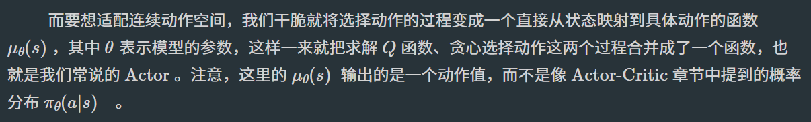

# Task06：DDPG算法、PPO算法、SAC算法、阅读视觉强化学习/ICLR'25Oral论文

## DDPG(Deep Deterministic Policy Gradient)算法
DDPG算法是一种结合了深度学习和确定性策略梯度(DPG)的强化学习算法，主要用于连续动作空间的问题。

首先我们知道DQN算法的一个主要缺点就是不能用于连续动作空间，这是因为在DQN算法中动作是通过贪心策略或者说argmax的方式来从Q函数间接得到（这里Q函数就相当于DDPG算法中的Critic网络，而Critic网络的输出是一个连续值）。想要适配连续的动作空间，就需要用到确定性策略梯度(DPG)算法。DPG核心是将选择动作的过程变成一个直接从状态映射到具体动作的函数，也就是所谓的策略网络。

DDPG算法的核心思想是使用两个神经网络，一个用于策略（Actor），另一个用于值函数评估（Critic）。在训练过程中，通过最小化Critic网络的损失来更新其参数，同时利用更新的Critic网络来改进Actor网络。

DDPG算法的优势和劣势：
- 优势：
  - 适用于连续动作空间，效果好。
- 劣势：
  - 训练过程相对复杂，需要同时更新两个网络。

## TD3(Twin Delayed DDPG)算法

## PPO(Proximal Policy Optimization)算法
PPO是TRPO(Trust Region Policy Optimization)和A2C(Actor-Critic)的结合体，是一种on-policy的算法。

[RSL_RL项目](https://github.com/leggedrobotics/rsl_rl)，一个经典的在GPU上运行的强化学习库，包含PPO算法实现、向量化环境、Actor-Critic网络结构等组件。

## SAC(Soft Actor-Critic)算法

## 阅读视觉强化学习/ICLR'25Oral论文

